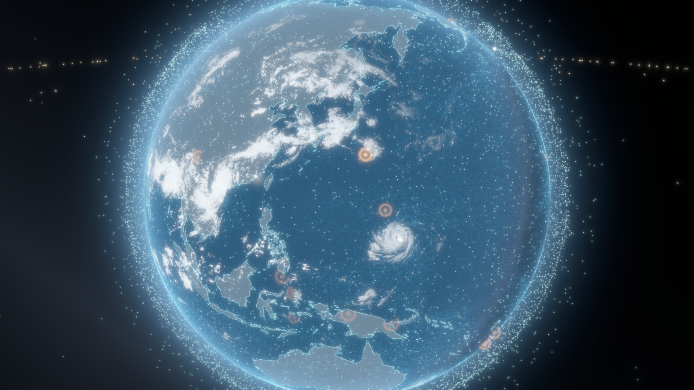
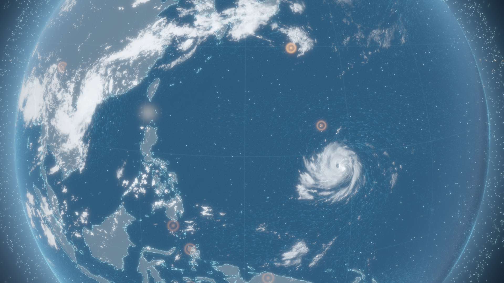
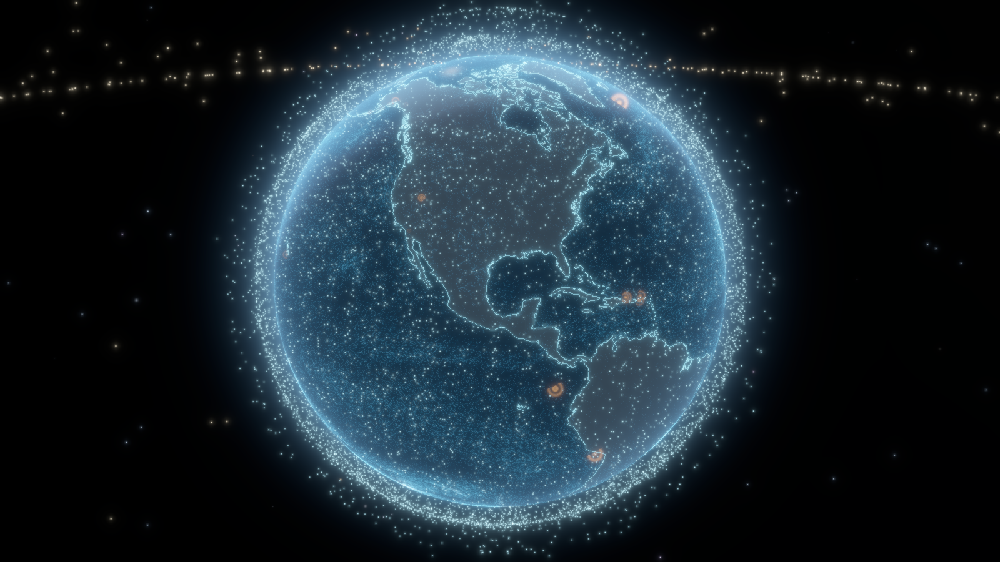

# coolviz ▸ LIVE EARTH 🌏

夏を乗り切るための、涼しくてかっこいい リアルタイム3D地球管制室。
役に立つかどうかは問わない — クールな可視化それ自体に意味がある。


*GFS実況風の台風、ひまわり9号の実況雲、SGP4伝播中の衛星約16,000機、USGSライブ地震。全部本物のデータ。*

| ひまわり実況雲 × 台風の目 | 夜側 |
|---|---|
|  |  |

**EN:** A mission-control Earth in native Rust + wgpu — a raytraced textureless globe with up to 2M compute-shader wind particles advected by live NOAA GFS data, ~16,000 satellites propagated with SGP4 (LEO swarm + the GEO belt), live USGS earthquakes, and Himawari-9 true-color clouds reprojected from geostationary orbit. Boots offline from vendored snapshots, swaps to live feeds in the background. `cargo run --release`.

## レイヤー

- **風** — NOAA GFS 0.25° の実況風を GPU compute shader で advect する数十万〜200万パーティクル（トレイル蓄積）。台風がいれば渦がそのまま見える
- **雲** — ひまわり9号のフルディスク実況画像（10分毎更新）を、静止軌道 (東経140.7°・高度35,786km) からの視線で球面に再投影。台風の目、梅雨前線まで本物
- **衛星** — CelesTrak 現役カタログ約16,000機を SGP4 で伝播。LEO の粒子雲、内側から見上げる GEO ベルト、ISS はラベル付き追跡
- **地震** — USGS M2.5+ 直近24時間、マグニチュード連動のパルスリング（画面唯一の「熱い色」）
- **地球** — テクスチャ画像ゼロ。Natural Earth 海岸線ベクタ＋起動時ラスタライズの陸マスク＋レイトレース球。昼夜境界・大気フレネル・海面の太陽反射・手続き星空
- HDR → ブルーム → トーンマップ、慣性オービットカメラ、egui HUD

## 起動

```sh
cargo run --release
```

初回起動は同梱スナップショット（風・衛星）と前回キャッシュ（雲）で即座に描画し、裏でライブデータに差し替わる。オフラインでも動く。

### 操作

| 操作 | 効果 |
|---|---|
| ドラッグ | 地球を回す |
| スクロール / ピンチ | ズーム（GEO ベルトの外まで引ける） |
| ダブルクリック | 視点リセット |
| 右クリック | HUD 表示切替 |
| HUD | レイヤー ON/OFF・パーティクル数・風速倍率・トレイル・露出 |

## ヘッドレスレンダリング

ウィンドウ無しで数百フレーム分シミュレートして PNG を保存（開発・共有用）：

```sh
cargo run --release -- --shot out.png --frames 240 --size 1920x1080 \
    --lat 17 --lon 136 --dist 1.85
```

動画用の連番フレーム出力（ffmpeg があれば mp4 化）：

```sh
cargo run --release -- --shot last.png --framedump frames/ --frames 360 --spin 3 --size 1600x900
ffmpeg -framerate 30 -i frames/%04d.png -c:v libx264 -pix_fmt yuv420p -crf 18 coolviz.mp4
```

## データソースと出典

| データ | 出典 | 備考 |
|---|---|---|
| 風 (10m u/v) | [NOAA NOMADS](https://nomads.ncep.noaa.gov) GFS 0.25° | GRIB filter で数百KBに絞って取得、15分毎に新サイクル確認 |
| 雲 | [NICT ひまわりリアルタイムWeb](https://himawari8.nict.go.jp) (Himawari-9) | **非商用利用のみ**。10分毎、失敗時はキャッシュ |
| 衛星軌道 | [CelesTrak](https://celestrak.org) GP (GROUP=active) | **2時間キャッシュ厳守**（先方ポリシー）。fallback は同梱スナップショット |
| 地震 | [USGS](https://earthquake.usgs.gov) 2.5_day GeoJSON | 5分毎 |
| 海岸線・陸地 | [Natural Earth](https://www.naturalearthdata.com) 50m/110m | パブリックドメイン、`assets/` に同梱 |

コードは MIT ライセンス。`assets/` の風・衛星スナップショットは上記出典の再配布物（デモ・オフライン起動用）。

## 構成

```
src/
  main.rs          eframe アプリ + HUD + ISS オーバーレイ + ヘッドレス --shot/--framedump
  camera.rs        慣性オービットカメラ
  astro.rs         GMST・太陽方向・TEME→ECEF→ワールド変換
  scene/           wgpu レンダラ（HDR/深度/トレイル ping-pong/ブルーム）
    globe.rs         フルスクリーン球レイトレース + 星空 + ひまわり雲再投影
    coast.rs         海岸線ラインストリップ
    particles.rs     風パーティクル compute + トレイル
    sprites.rs       衛星・地震の汎用ビルボードパス
    post.rs          composite / bloom / tonemap
  data/            データ取得スレッド（GRIB デコード・SGP4・GeoJSON・ひまわりタイル）
  shaders/         WGSL 一式
```

Rust + wgpu 29 (Metal) / eframe 0.35。外部テクスチャアセットなし、全部シェーダーとベクタデータと実況データ。
