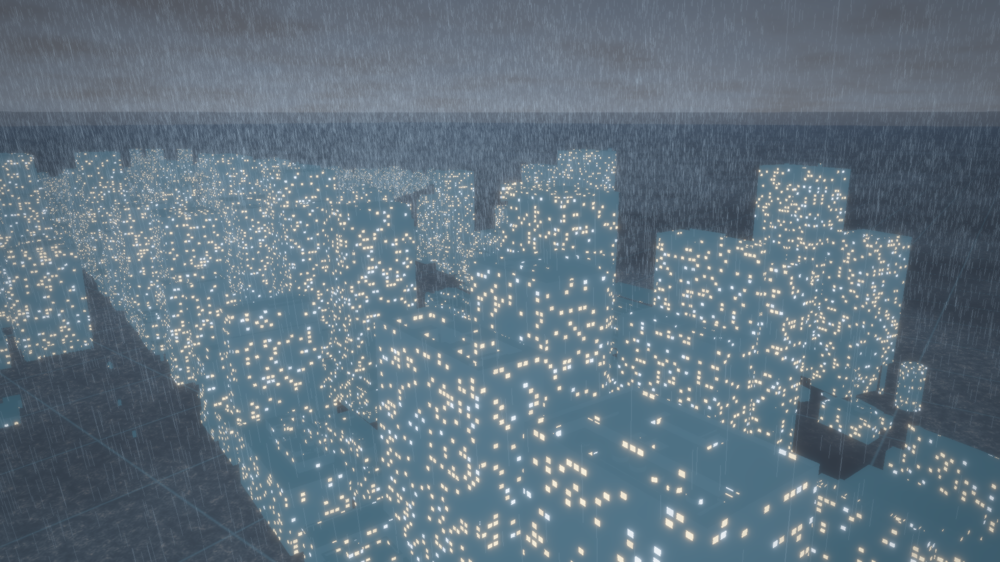
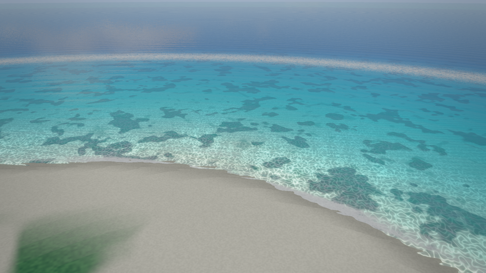
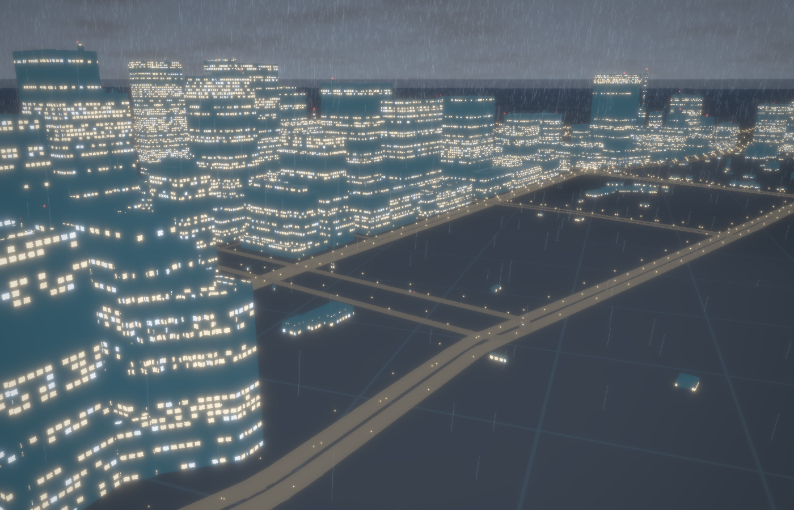
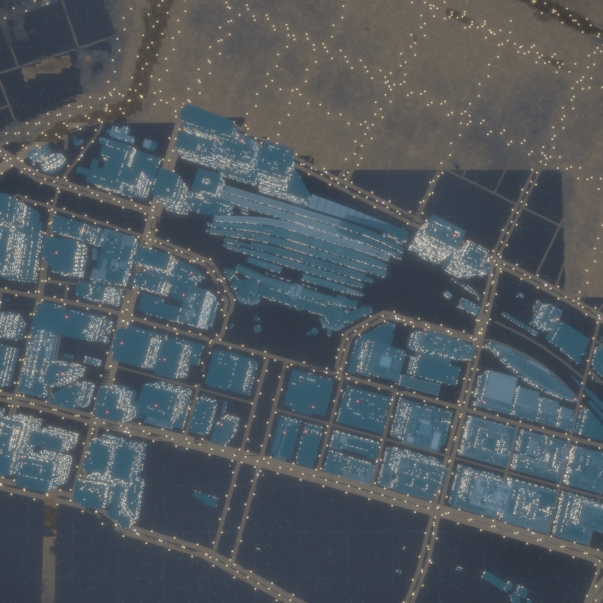

# coolviz ▸ LIVE EARTH 🌏

夏を乗り切るための、涼しくてかっこいい リアルタイム3D地球管制室。
役に立つかどうかは問わない — クールな可視化それ自体に意味がある。


*GFS実況風の台風、ひまわり9号の実況雲、SGP4伝播中の衛星約16,000機、USGSライブ地震。全部本物のデータ。*

| ひまわり実況雲 × 台風の目 | 夜側 |
|---|---|
|  |  |

**EN:** A mission-control Earth in native Rust + wgpu — a raytraced textureless globe with up to 2M compute-shader wind particles advected by live NOAA GFS data, ~16,000 satellites propagated with SGP4 (LEO swarm + the GEO belt), live USGS earthquakes, and Himawari-9 true-color clouds reprojected from geostationary orbit. Boots offline from vendored snapshots, swaps to live feeds in the background. Plus two local scenes that share a **GPU shallow-water simulation** (virtual pipe model, 512² cells): **TOKYO FLOOD** (an urban-river flood scenario pouring through real PLATEAU buildings over real GSI terrain, fed by the live JMA rain nowcast) and **OKINAWA SEA** (a reef lagoon whose surface is simulated — swell refracts over the bathymetry and you can splash it with the mouse). `cargo run --release`.

## モード

HUD 上部の **EARTH / TOKYO / OKINAWA** で切替。

| TOKYO STORM ⛈️ | OKINAWA SEA 🏝️ |
|---|---|
|  |  |

### TOKYO FLOOD 🌊 — 浅水方程式シミュレーション

丸の内のオフィス街へ皇居の濠が溢れ出す（GPU 浅水シミュレーション、512²セル・6.5m解像度・実測標高）：



俯瞰マップで見ると、水路から溢れた水が街路網を這って広がっていくのが分かる（動画は下の `--framedump` コマンドで生成できます）：



- **TOKYO STORM / FLOOD** — [Project PLATEAU](https://www.mlit.go.jp/plateau/) の実3D建物（千代田区 LOD1、初回起動時に自動取得・キャッシュ）に、JMA 高解像度降水ナウキャストの実況雨を35万粒の GPU パーティクルとして降らせる。さらに国土地理院の実標高（dem5a）を512²グリッドに敷き、**浅水方程式（virtual pipe model）の GPU シミュレーション**で洪水を再現：
  - HUD の「**都心河川氾濫シナリオ**」を ON にすると、DEM 上の実在水路（日本橋川・神田川・皇居の濠）の水位が上昇し、街路網へ溢れ出す。建物 AABB は地形に焼き込まれるので、水はビルを避けて**実際の道を川のように**流れる
  - 実況ナウキャストの雨はそのまま流出源になる（降った所に水が溜まる）。時間倍率スライダー（1〜600×）とリセットつき
- **OKINAWA SEA** — 手続き生成のリーフ地形の上で**同じ浅水シミュレーション**が走る：外洋からのうねりが島へ向かって伝播し、リーフで屈折・砕波する。**水面をクリックすると水しぶき**が立ち、波紋がラグーンを渡っていく。深度による光吸収・海底コースティクス・砂浜・積雲はレイマーチシェーダー

## レイヤー

- **風** — NOAA GFS 0.25° の実況風を GPU compute shader で advect する数十万〜200万パーティクル（トレイル蓄積）。台風がいれば渦がそのまま見える
- **雲** — ひまわり9号のフルディスク実況画像（10分毎更新）を、静止軌道 (東経140.7°・高度35,786km) からの視線で球面に再投影。台風の目、梅雨前線まで本物
- **衛星** — CelesTrak 現役カタログ約16,000機を SGP4 で伝播。LEO の粒子雲、内側から見上げる GEO ベルト、ISS はラベル付き追跡
- **地震** — USGS M2.5+ 直近24時間、マグニチュード連動のパルスリング（画面唯一の「熱い色」）
- **地球** — テクスチャ画像ゼロ。Natural Earth 海岸線ベクタ＋起動時ラスタライズの陸マスク＋レイトレース球。昼夜境界・大気フレネル・海面の太陽反射・手続き星空
- HDR → ブルーム → トーンマップ、慣性オービットカメラ、egui HUD

## 起動

```sh
cargo run --release
```

初回起動は同梱スナップショット（風・衛星）と前回キャッシュ（雲）で即座に描画し、裏でライブデータに差し替わる。オフラインでも動く。

### 操作

| 操作 | 効果 |
|---|---|
| ドラッグ | 地球を回す |
| スクロール / ピンチ | ズーム（GEO ベルトの外まで引ける） |
| **マウスホバー** | EARTH: 衛星に合わせると**名前・軌道種別・高度・速度**、地震リングは**マグニチュード・震源地・経過時間**、何もない海上は**緯度経度と実況風速**。TOKYO: 建物の**名称・高さ・階数・構造・用途・住所・ハザードマップ想定浸水深**。OKINAWA: 水深・地形 |
| **クリック (OKINAWA)** | 水面に水しぶき — 波紋がシミュレーションを伝わる |
| ダブルクリック | 視点リセット |
| 右クリック | HUD 表示切替 |
| HUD | モード切替（EARTH/TOKYO/OKINAWA）・レイヤー ON/OFF・パーティクル数・露出ほか |

## ヘッドレスレンダリング

ウィンドウ無しで数百フレーム分シミュレートして PNG を保存（開発・共有用）。
※「ヘッドレス」＝ウィンドウ不要という意味で、**GPU 自体は必要**です（macOS なら Metal）。GPU の無い CI・サーバでは `no GPU adapter` で終了します：

```sh
cargo run --release -- --shot out.png --frames 240 --size 1920x1080 \
    --lat 17 --lon 136 --dist 1.85
# ローカルシーン: --mode tokyo / --mode okinawa (--demo 0 でライブ雨のみ)
cargo run --release -- --shot tokyo.png --mode tokyo --lat 16 --lon 215 --dist 1.9
# 洪水シナリオ: --flood（+ --target x,z で注視点をシーン内の任意地点へ）
cargo run --release -- --shot flood.png --mode tokyo --flood --demo 0 \
    --frames 220 --lat 16 --lon 110 --dist 0.8 --target -450,-100
```

動画用の連番フレーム出力（ffmpeg があれば mp4 化）：

```sh
cargo run --release -- --shot last.png --framedump frames/ --frames 360 --spin 3 --size 1600x900
ffmpeg -framerate 30 -i frames/%04d.png -c:v libx264 -pix_fmt yuv420p -crf 18 coolviz.mp4
# 洪水タイムラプス（15秒 / 60fps / シム内約70分）
cargo run --release -- --shot last.png --mode tokyo --flood --demo 0 --frames 900 \
    --lat 88 --lon 180 --dist 3.4 --size 1100x1100 --framedump frames/
```

## データソースと出典

| データ | 出典 | 備考 |
|---|---|---|
| 風 (10m u/v) | [NOAA NOMADS](https://nomads.ncep.noaa.gov) GFS 0.25° | GRIB filter で数百KBに絞って取得、15分毎に新サイクル確認 |
| 雲 | [NICT ひまわりリアルタイムWeb](https://himawari8.nict.go.jp) (Himawari-9) | **非商用利用のみ**。latest.json を3分毎に確認し、新画像のときだけタイル取得（元データは10分毎）。失敗時はキャッシュ |
| 衛星軌道 | [CelesTrak](https://celestrak.org) GP (GROUP=active) | **2時間キャッシュ厳守**（先方ポリシー）。fallback は同梱スナップショット |
| 地震 | [USGS](https://earthquake.usgs.gov) 2.5_day GeoJSON | 5分毎 |
| 海岸線・陸地 | [Natural Earth](https://www.naturalearthdata.com) 50m/110m | パブリックドメイン、`assets/` に同梱 |
| 3D都市モデル | [Project PLATEAU](https://www.mlit.go.jp/plateau/)（国土交通省）東京23区 3D Tiles (2020) | CC BY 4.0 相当。初回起動時に取得し `.cache/plateau/` へ（~40MB） |
| 雨雲ナウキャスト | JMA 高解像度降水ナウキャスト タイル | ⚠️ 非公式エンドポイント。latest確認は2分毎・タイル取得は新画像時のみ |
| 標高 | [国土地理院 標高タイル](https://maps.gsi.go.jp/development/ichiran.html) (dem5a, z15) | 出典明記。初回取得後 `.cache/gsi/` にキャッシュ |

**ライセンス**：コードは MIT（[LICENSE](LICENSE)）。データスナップショットとスクリーンショットの出所・条件は [NOTICE.md](NOTICE.md) を参照。特に `docs/hero.png` と `docs/typhoon.png` はひまわり9号画像（NICT・**非商用限定**）を含むため MIT の対象外です。

## 構成

```
src/
  main.rs          eframe アプリ + HUD + ISS オーバーレイ + ヘッドレス --shot/--framedump
  camera.rs        慣性オービットカメラ
  astro.rs         GMST・太陽方向・TEME→ECEF→ワールド変換
  scene/           wgpu レンダラ（HDR/深度/トレイル ping-pong/ブルーム）
    globe.rs         フルスクリーン球レイトレース + 星空 + ひまわり雲再投影
    coast.rs         海岸線ラインストリップ
    particles.rs     風パーティクル compute + トレイル
    sprites.rs       衛星・地震の汎用ビルボードパス
    post.rs          composite / bloom / tonemap
    tokyo.rs         都市パス（建物・道路・雨・洪水水面・街灯/車ライト）
    ocean.rs         沖縄ラグーンのレイマーチ（シム水面駆動）
    swe.rs           浅水方程式 GPU シミュレーション（東京/沖縄で共用）
  data/            データ取得スレッド（GRIB デコード・SGP4・GeoJSON・ひまわり/雨/標高タイル・PLATEAU b3dm・OSM道路）
  shaders/         WGSL 一式（swe.wgsl = flux/height/blit の3パス）
```

Rust + wgpu 29 (Metal) / eframe 0.35。外部テクスチャアセットなし、全部シェーダーとベクタデータと実況データ。
